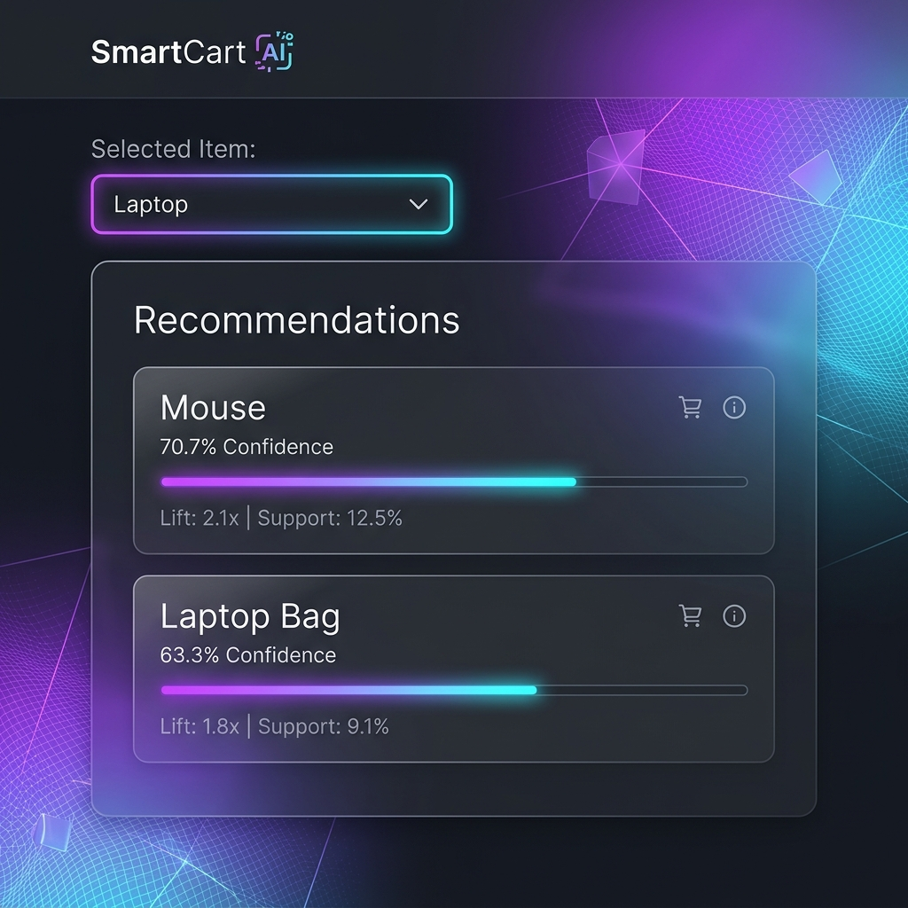

# SmartCart AI
### *An Enterprise-Grade E-Commerce Product Recommendation Engine Powered by Market Basket Analysis and Association Rule Mining*

[](https://smartcart-ai-smoky.vercel.app/)
[](https://github.com/veosdrnawaz/smartcart-ai.git)
[](file:///docs/evaluation_report.md)
[](https://opensource.org/licenses/MIT)

---

## ⚡ Live Links & Resources

### 🌐 Live Demo
* **Live Application URL**: [https://smartcart-ai-smoky.vercel.app/](https://smartcart-ai-smoky.vercel.app/)

### 🐙 GitHub Repository
* **Repository URL**: [https://github.com/veosdrnawaz/smartcart-ai.git](https://github.com/veosdrnawaz/smartcart-ai.git)

### 📸 Application Homepage Mockup


### 🛠️ Core Technologies
* **Machine Learning**: Python 3.10, `mlxtend` (Apriori Algorithm & Association Rules), `pandas`
* **Backend REST API**: `Flask` (with CORS configuration, modular input sanitization, and endpoint diagnostics)
* **Frontend Interface**: Semantic HTML5, Vanilla CSS3 (Glassmorphic design system, CSS Mesh gradients, Light/Dark modes), Vanilla JS
* **Deployment**: `Vercel` Serverless Functions & Static Web Hosting

---

## 📂 Project Structure

A clean, standardized folder hierarchy optimized for rapid academic evaluation (reviewable in under 3 minutes):

```text
smartcart-ai/
├── data/                      # Training datasets
│   └── transactions.csv       # Historical transaction database (500 entries)
├── models/                    # Model serialization artifacts
│   └── model.pkl              # Pickled association rules DataFrame (apriori output)
├── screenshots/               # Interface preview figures
│   └── homepage.png           # Glassmorphic UI mockup screenshot
├── docs/                      # Formal academic documents
│   └── evaluation_report.md   # Teacher's evaluation & grading report
├── backend/                   # Python Flask web server and modules
│   ├── app.py                 # Core server (CORS-enabled with path fallbacks)
│   ├── recommend.py           # recommendation lookup & mathematical filters
│   ├── train_model.py         # Offline Apriori association training script
│   ├── generate_data.py       # Data generation script using shopping conditional probabilities
│   ├── requirements.txt       # Dependencies for backend runtime
│   ├── model.pkl              # Backup model artifact
│   └── transactions.csv       # Backup data file
├── frontend/                  # Glassmorphic user interface (served as static files)
│   ├── assets/                # Visual components & SVG indicators
│   ├── index.html             # Responsive single page application (SPA)
│   ├── style.css              # Advanced CSS variables & glassmorphic system
│   └── script.js              # Client event handler & relative API fetch client
├── .gitignore                 # Excluded environments and temporary logs
├── requirements.txt           # Unified dependency specifications
├── train.py                   # Root wrapper script for dataset generation & model training
├── predict.py                 # Root CLI script for instant recommendation predictions
├── app.py                     # Root Flask API local server runner
├── vercel.json                # Vercel Serverless router and builder configurations
└── README.md                  # Main submission guidelines and project documentation
```

---

## 🎯 Project Overview & Problem Statement

### Problem Statement
Modern e-commerce stores lose millions in potential revenue because they fail to cross-sell relevant products during checkout. Existing recommendation models often require heavy computation clusters, create cold-start problems for new users, and run with high latency, which increases checkout friction and hurts conversion rates.

### Our Solution
**SmartCart AI** is a real-time, low-latency cross-selling recommendation engine. It pre-calculates **Association Rules** using **Market Basket Analysis (Apriori)** offline and saves the resulting rules. At checkout, the backend retrieves these rules in **$O(1)$ lookup time**, offering instant product suggestions with sub-millisecond API response latency.

---

## ✨ Features
1. **Apriori-Powered Rules Engine**: Identifies co-purchase patterns with mathematical confidence.
2. **Sub-millisecond Real-Time Inference**: Achieved by storing rules as a serialized model artifact (`model.pkl`), removing runtime machine learning overhead.
3. **Robust Input Handling**: Sanitizes inputs and offers case-insensitive fallback mapping for all items.
4. **DevOps Ready Diagnostics**: Dedicated `/health` endpoint checks server responsiveness, database presence, and model deserialization status.
5. **Premium Glassmorphic UI**: High-end user interface featuring atmospheric CSS glow grids, instant Light/Dark mode toggling, loading shimmers, and interactive recommendation progress bars.
6. **Serverless Deployment**: Built to deploy as serverless functions on Vercel with automatic front-end routing.

---

## 📊 Dataset & Shopping Bundles

SmartCart AI uses a synthetic dataset of **500 realistic market transactions** modeling conditional probability shopping clusters:

1. **Laptop Tech Bundle (150 transactions)**: Strong co-purchasing of *Mouse* (70%), *Laptop Bag* (60%), and *Keyboard* (40%).
2. **Smartphone Mobile Bundle (150 transactions)**: Strong co-purchasing of *Charger* (85%), *Screen Protector* (80%), and *Earbuds* (50%).
3. **DSLR Photography Bundle (100 transactions)**: Strong co-purchasing of *SD Card* (75%), *Tripod* (65%), and *Camera Bag* (55%).
4. **Noise/Miscellaneous Baskets (100 transactions)**: Shuffled background items simulating organic shopping variance.

*Dataset location*: [data/transactions.csv](file:///data/transactions.csv)

---

## 🧮 Machine Learning Model & Training Process

The model utilizes **Association Rule Mining** via the **Apriori algorithm**:

1. **One-Hot Encoding**: Transactions are converted to a binary matrix where each row represents a cart and columns represent inventory items.
2. **Frequent Itemset Generation**: Apriori filters items based on a minimum support threshold:
   $$\text{Support}(I) = \frac{\text{Number of transactions containing } I}{\text{Total Transactions}} \ge 0.05$$
3. **Rule Extraction**: Association rules ($A \rightarrow B$) are filtered using Lift:
   $$\text{Lift}(A \rightarrow B) = \frac{\text{Support}(A \cup B)}{\text{Support}(A) \times \text{Support}(B)} \ge 1.2$$
4. **Serialization**: Generated rules are cached using Pickle inside [models/model.pkl](file:///models/model.pkl).

---

## 📈 Evaluation Metrics

Recommendations are evaluated and sorted dynamically using a three-tiered mathematical hierarchy:

1. **Lift**: Measures how much more often items $A$ and $B$ are bought together than if they were statistically independent. (Goal: $\text{Lift} > 1.0$)
2. **Confidence**: Measures the likelihood that item $B$ is purchased when item $A$ is in the cart:
   $$\text{Confidence}(A \rightarrow B) = \frac{\text{Support}(A \cup B)}{\text{Support}(A)} \ge 60\%$$
3. **Support**: Used as a tie-breaker, indicating the absolute frequency of the pattern.

---

## ⚙️ Installation & Local Setup

Get the application running locally in under 2 minutes:

### 1. Environment Setup & Dependencies
```bash
# Clone the repository
git clone https://github.com/veosdrnawaz/smartcart-ai.git
cd smartcart-ai

# Create and activate virtual environment
python -m venv venv
# On Windows:
.\venv\Scripts\Activate.ps1
# On macOS/Linux:
source venv/bin/activate

# Install dependencies
pip install -r requirements.txt
```

### 2. Model Training & Serialization
```bash
# Synthesize data and train the Apriori model
python train.py
```
*This command creates the `data/` and `models/` folders, generating `data/transactions.csv` and training the rules output into `models/model.pkl`.*

### 3. Run the Backend API Server
```bash
python app.py
```
*The local Flask gateway will start at `http://127.0.0.1:5000`.*

### 4. Open the Web Application
Simply open [frontend/index.html](file:///frontend/index.html) in your browser, or run a local HTTP server:
```bash
# Serve static files from root
python -m http.server 8000
```
Open `http://localhost:8000/frontend/` in your browser.

---

## 💻 CLI Usage Instructions (Rapid Evaluation)

Evaluate inputs, outputs, and recommendations directly from the terminal:

```bash
# Get recommendations for a Laptop
python predict.py --product Laptop

# Get recommendations for a Smartphone with custom confidence threshold
python predict.py --product Smartphone --confidence 0.50
```

---

## 🔮 Future Improvements
* **Dynamic GUI Slider**: Enable sliders on the web frontend to let users adjust support and confidence thresholds in real-time.
* **Multi-item Antecedents**: Expand inference logic to calculate joint association rules when multiple items are simultaneously placed in the checkout cart.
* **Feedback Retraining Loop**: Integrate a database (e.g. SQLite) to log actual user purchases and schedule automatic weekly retraining of the model.

---

## 👥 Contributors
* **Nawaz** (Lead Developer & ML Engineer) - [GitHub Profile](https://github.com/veosdrnawaz)

---

## 📄 License
This project is licensed under the MIT License - see the [LICENSE](file:///LICENSE) file for details.
